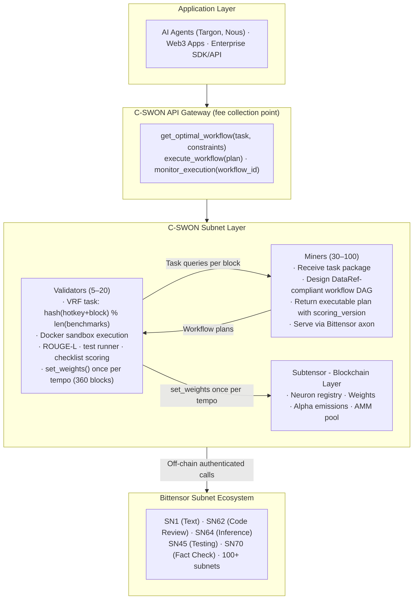
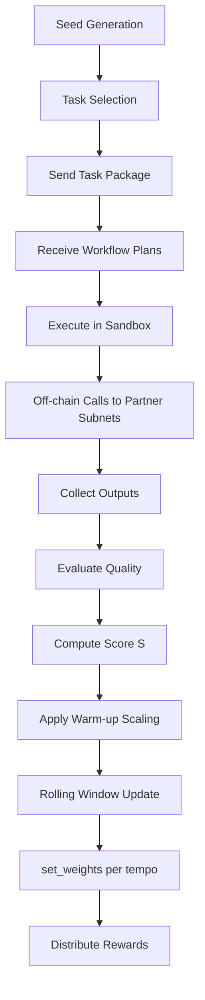

# 2.1 System Architecture

## High-Level Architecture

## Validation Cycle

## Risk Register

| Risk | Impact | Mitigation |
|---|---|---|
| Low miner participation | Network fails to bootstrap | 3x query frequency for early miners; GPU credits; $50K grants |
| Validator centralization | Collusion risk | Deterministic task schedule; Yuma bond mechanism |
| Benchmark staleness | Miners overfit | Deprecation at >70% scoring 0.90+ for 3 tempos |
| Competing orchestration layer | Market fragmentation | First-mover; network effects; deep Bittensor integration |
| High execution costs | Developers avoid C-SWON | Cost dimension in scoring; gateway subsidises early usage |
| Negative net TAO inflows | Zero emissions (Taoflow) | Active staker acquisition; public Alpha ROI dashboard |
| Pre-caching attack | Miners memorise all tasks | VRF task schedule keyed to (validator_hotkey, block) |
| Partner subnet non-determinism | Scores diverge across validators | Canonical routing policy in benchmark JSON |
| Buggy benchmark task | Dead weight in scoring pool | Quarantine trigger + auto-remove after 5 tempos |

---

## Navigation

| | |
|---|---|
| ← Previous | [1.3 Quickstart: Validator](1.3-quickstart-validator.md) |
| → Next | [2.2 WorkflowSynapse Protocol](2.2-protocol.md) |
| Index | [Documentation Index](INDEX.md) |
