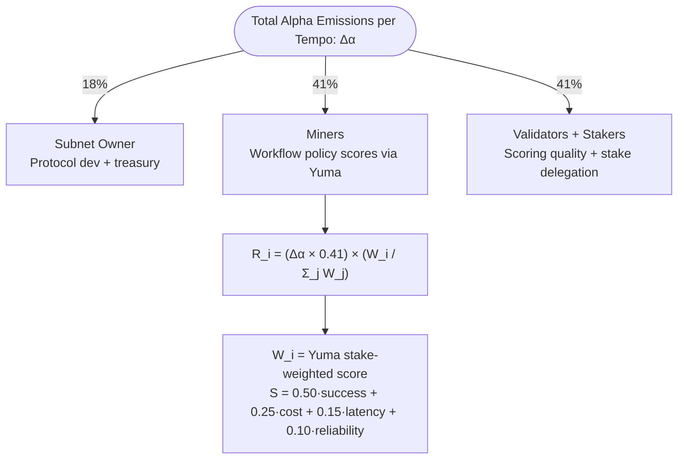

# 3.1 Emission Structure (dTAO)

C-SWON operates under Bittensor's Dynamic TAO (dTAO) model. All participant rewards are paid in **CSWON Alpha tokens**, not TAO directly. TAO is injected into the subnet's AMM liquidity pool each block, and Alpha is distributed via Yuma Consensus at the end of each **tempo** (default: 360 blocks / ~72 minutes).

## Alpha Emission Split

| Variable | Unit | Definition |
|---|---|---|
| Δα | Alpha/tempo | Total Alpha allocated to participants per tempo |
| R_i | Alpha | Reward to miner i per tempo |
| W_i | float [0,1] | Yuma stake-weighted composite score for miner i |
| W_j | float [0,1] | Score for miner j — normalisation denominator |

## TAO Liquidity

TAO is injected into the C-SWON AMM pool at each block proportionally to Alpha injection, stabilising the Alpha price. Stakers who hold TAO on the root subnet receive a portion of validator dividends converted to TAO via this AMM swap.

## Halving

Alpha participant rewards follow the Alpha supply schedule. TAO halving events affect TAO injection into the AMM pool, but Alpha distribution per tempo is governed by net TAO inflows and dTAO allocation — not by the TAO halving directly.

---

## Navigation

| | |
|---|---|
| ← Previous | [2.3 DAG Execution Model](2.3-dag-execution.md) |
| → Next | [3.2 Scoring Formula](3.2-scoring-formula.md) |
| Index | [Documentation Index](INDEX.md) |
