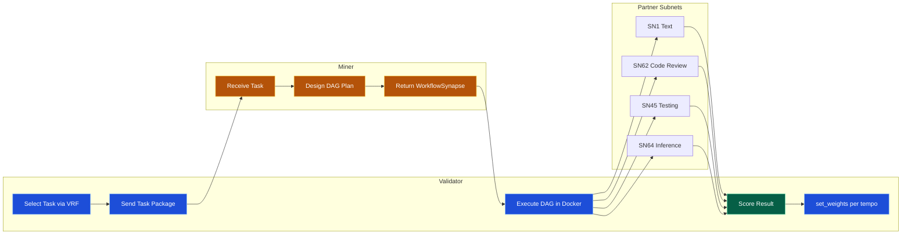
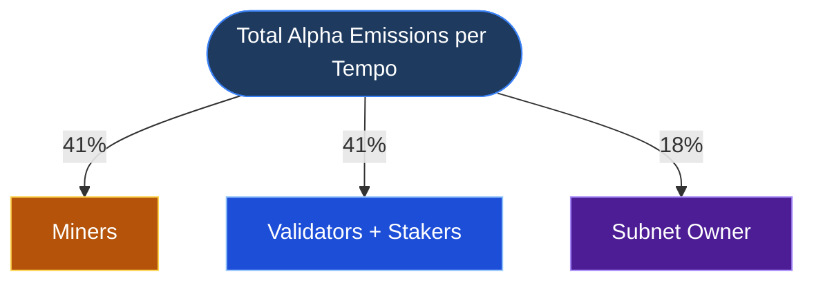

# C-SWON: Cross-Subnet Workflow Orchestration Network

**C-SWON is a decentralised AI workflow router built on Bittensor.** You give it a task; it competes to find which combination of AI services produces the best result at the lowest cost, learns from that competition, and improves over time.

> *"Zapier for Subnets"* — The Intelligence Layer for Multi-Subnet Composition

| | |
|---|---|
| **Testnet Netuid** | `26` — [Verify live](https://test.taostats.io/) |
| **Demo Video** | [youtu.be/XmyTpWDTs5g](https://youtu.be/XmyTpWDTs5g) |
| **Pitch Video** | [youtu.be/klJUeZswmoE](https://youtu.be/klJUeZswmoE) |
| **Documentation** | [adysingh5711.github.io/C-SWON](https://adysingh5711.github.io/C-SWON/) |
| **Frontend** | [c-swon.vercel.app](https://c-swon.vercel.app/) |

---

## The Problem

Bittensor hosts **100+ specialized subnets** — text generation, code review, inference, agents, data processing — yet there is no native way to compose them into reliable, end-to-end workflows. Developers manually wire 5–10 subnets per application, guess at optimal routing, and rebuild orchestration logic from scratch every time.

## The Solution: Optimal Workflow Policy as a Commodity

C-SWON is a Bittensor subnet where **the mined commodity is optimal workflow policy** — which subnets to call, in what order, with what parameters, to complete a task at the lowest cost and highest quality.

- **Miners** propose multi-subnet execution plans (DAGs)
- **Validators** execute plans in sandboxed Docker containers and score them
- **Scoring** is fully deterministic — ROUGE-L, test pass rates, schema validation — no LLM judge
- **Weights** are set per tempo via Yuma Consensus

---

## Quick Navigation

| I am a... | My starting point |
|---|---|
| **Miner** | [Quickstart Miner](docs/1.2-quickstart-miner.md) |
| **Validator** | [Quickstart Validator](docs/1.3-quickstart-validator.md) |
| **Developer integrating C-SWON** | [WorkflowSynapse Protocol](docs/2.2-protocol.md) |
| **Hackathon Judge** | [Testnet Evidence](docs/7.1-testnet-evidence.md) → [Incentive Verification](docs/7.3-incentive-verification.md) |
| **Exploring the design** | [What is C-SWON?](docs/1.1-what-is-cswon.md) |

---

## How It Works



---

## Emission Structure



Miner rewards are proportional to their composite score `W_i` via Yuma Consensus:

**`R_i = (Δα × 0.41) × (W_i / Σ W_j)`**

---

## Scoring Formula (v1.0.0)

```
S = 0.50 × S_success + 0.25 × S_cost + 0.15 × S_latency + 0.10 × S_reliability
```

| Dimension | Weight | What it measures |
|---|---|---|
| **Task Success** | 50% | `output_quality × completion_ratio` — deterministic (ROUGE-L, test pass rate) |
| **Cost Efficiency** | 25% | `max(0, 1 − actual/budget)` — gated: only scored when S_success > 0.7 |
| **Latency** | 15% | `max(0, 1 − actual_s/max_s)` — gated: only scored when S_success > 0.7 |
| **Reliability** | 10% | `1 − penalties` for unplanned retries, timeouts, failures |

> **Success-first gating:** A workflow that fails the task scores 0 on cost and latency — you cannot game the system with cheap, fast, broken workflows.

[Full formula details →](docs/3.2-scoring-formula.md)

---

## Anti-Gaming Mechanisms

| Mechanism | How it prevents gaming |
|---|---|
| **VRF-keyed task schedule** | Each validator derives tasks from `hash(hotkey + block)` — miners cannot pre-cache responses |
| **Synthetic ground truth (15-20%)** | Hidden known-answer tasks verify miners are actually planning, not memorizing |
| **Benchmark rotation** | Tasks deprecated when >70% miners score >0.90 for 3 consecutive tempos |
| **Execution sandboxing** | Docker containers track actual cost, latency, retries — no self-reporting |
| **15% weight cap per miner** | Prevents single-miner dominance of emissions |
| **Deterministic scoring** | ROUGE-L, test runners, schema validation — no LLM judge, no subjective evaluation |

[Full anti-gaming details →](docs/3.4-anti-gaming.md)

---

## Testnet Status

```bash
btcli subnet metagraph --netuid 26 --subtensor.network test
```

- **14 registered nodes** — 10 miners + 3 validators + 1 owner
- **All 13 non-owner nodes actively serving** on `136.185.198.230`
- Total stake: **3.07k ב** · Total emission: **296.02 ב**
- TAO Pool: τ 321.06 · Rate: 61,411 τ/ב
- Scoring version: `1.0.0` · Execution mode: `CSWON_MOCK_EXEC=true`

[Full testnet evidence →](docs/7.1-testnet-evidence.md) · [Validator logs →](docs/7.2-validator-logs.md) · [Incentive verification →](docs/7.3-incentive-verification.md)

---

## Quick Install

```bash
git clone https://github.com/adysingh5711/C-SWON.git
cd C-SWON
pip install -r requirements.txt
pip install -e .
```

**Run a miner:**
```bash
python neurons/miner.py --netuid 26 --subtensor.network test \
  --wallet.name my_miner --wallet.hotkey default --axon.port 8091 --wandb.off
```

**Run a validator:**
```bash
export CSWON_MOCK_EXEC=true
export CSWON_SYNTHETIC_SALT=$(python -c "import secrets; print(secrets.token_hex(32))")

python neurons/validator.py --netuid 26 --subtensor.network test \
  --wallet.name my_validator --wallet.hotkey default --axon.port 8092 --wandb.off
```

[Full miner guide →](docs/1.2-quickstart-miner.md) · [Full validator guide →](docs/1.3-quickstart-validator.md)

---

## SDK Integration (Preview)

```python
from cswon import WorkflowGateway

gw = WorkflowGateway(wallet=my_wallet, netuid=26)
result = gw.execute(
    "Generate a FastAPI endpoint with JWT auth and unit tests",
    constraints={"max_budget_tao": 0.05, "max_latency_seconds": 10}
)
```

---

## Documentation

Full documentation: [`docs/`](docs/) directory · [Documentation website](https://adysingh5711.github.io/C-SWON/)

| Section | Contents |
|---|---|
| **Getting Started** | [1.1 What is C-SWON?](docs/1.1-what-is-cswon.md) · [1.2 Miner Quickstart](docs/1.2-quickstart-miner.md) · [1.3 Validator Quickstart](docs/1.3-quickstart-validator.md) |
| **Architecture** | [2.1 System Architecture](docs/2.1-architecture.md) · [2.2 Protocol](docs/2.2-protocol.md) · [2.3 DAG Execution](docs/2.3-dag-execution.md) |
| **Incentive Design** | [3.1 Emissions](docs/3.1-emission-structure.md) · [3.2 Scoring](docs/3.2-scoring-formula.md) · [3.3 Quality](docs/3.3-quality-scoring.md) · [3.4 Anti-Gaming](docs/3.4-anti-gaming.md) · [3.5 Versioning](docs/3.5-scoring-versioning.md) |
| **Miner Guide** | [4.1 Registration](docs/4.1-miner-registration.md) · [4.2 Workflow Plan](docs/4.2-workflow-plan.md) · [4.3 Lifecycle](docs/4.3-miner-lifecycle.md) · [4.4 Early Participation](docs/4.4-early-participation.md) |
| **Validator Guide** | [5.1 Hardware](docs/5.1-validator-hardware.md) · [5.2 Pipeline](docs/5.2-evaluation-pipeline.md) · [5.3 Weights](docs/5.3-weight-submission.md) · [5.4 Governance](docs/5.4-benchmark-governance.md) · [5.5 Exec Pool](docs/5.5-exec-support-pool.md) · [5.6 Immunity](docs/5.6-immunity-warmup.md) |
| **Deployment** | [6.1 Testnet](docs/6.1-running-on-testnet.md) · [6.2 Mainnet](docs/6.2-running-on-mainnet.md) · [6.3 Local](docs/6.3-running-on-staging.md) · [6.4 Local Deploy](docs/6.4-local-deploy.md) · [6.5 Testnet Deploy](docs/6.5-testnet-deploy.md) |
| **Evidence** | [7.1 Testnet Evidence](docs/7.1-testnet-evidence.md) · [7.2 Validator Logs](docs/7.2-validator-logs.md) · [7.3 Incentive Verification](docs/7.3-incentive-verification.md) |
| **Economics** | [8.1 Token Economy](docs/8.1-token-economy.md) · [8.2 Go-to-Market](docs/8.2-go-to-market.md) · [8.3 Roadmap](docs/8.3-roadmap.md) |
| **Contributing** | [9.1 Contributing Guide](docs/9.1-contributing.md) |

---

## Repository Structure

```
C-SWON/
├── cswon/                   # Core subnet package
│   ├── protocol.py          # WorkflowSynapse — single source of truth
│   ├── base/                # BaseValidator / BaseMiner abstract classes
│   ├── validator/           # Scoring, execution, weight submission (3,035 LOC)
│   ├── miner/               # Subnet profiler, workflow planning
│   ├── api/                 # External-facing HTTP endpoints
│   └── utils/               # Shared helpers
├── neurons/                 # Entry points: validator.py, miner.py
├── tests/                   # Unit + integration tests (9 test files)
├── benchmarks/              # Versioned benchmark task datasets (v1.json)
├── docs/                    # Full numbered documentation (32 files)
├── frontend/                # Next.js dashboard (metagraph, DAG viewer, scores)
├── documentation_website/   # Docusaurus documentation site
├── contrib/                 # Contributing guidelines, style guide
└── scripts/                 # Benchmark generation, deployment helpers
```

---

## Links

| Resource | URL |
|---|---|
| GitHub | [github.com/adysingh5711/C-SWON](https://github.com/adysingh5711/C-SWON) |
| Demo Video | [youtu.be/X2RZts7AXX0](https://youtu.be/X2RZts7AXX0) |
| Documentation | [adysingh5711.github.io/C-SWON](https://adysingh5711.github.io/C-SWON/) |
| Frontend | [c-swon.vercel.app](https://c-swon.vercel.app/) |
| Hackathon | [HackQuest Submission](https://www.hackquest.io/hackathons/Bittensor-Subnet-Hackathon) |
| Bittensor Docs | [docs.learnbittensor.org](https://docs.learnbittensor.org) |

---

## Contact

| | |
|---|---|
| **Email** | [singhaditya5711@gmail.com](mailto:singhaditya5711@gmail.com) |
| **Twitter / X** | [@singhaditya5711](https://x.com/singhaditya5711) |
| **Telegram** | [@singhaditya5711](https://t.me/singhaditya5711) |
| **LinkedIn** | [singhaditya5711](https://www.linkedin.com/in/singhaditya5711/) |

---

## License

MIT License — see [LICENSE](LICENSE) for details.

---

*C-SWON: Cross-Subnet Workflow Orchestration Network — Making Bittensor Composable*
